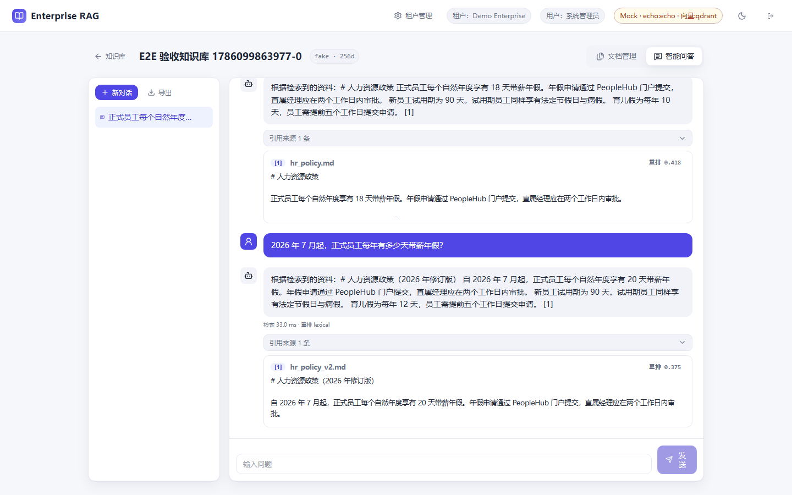
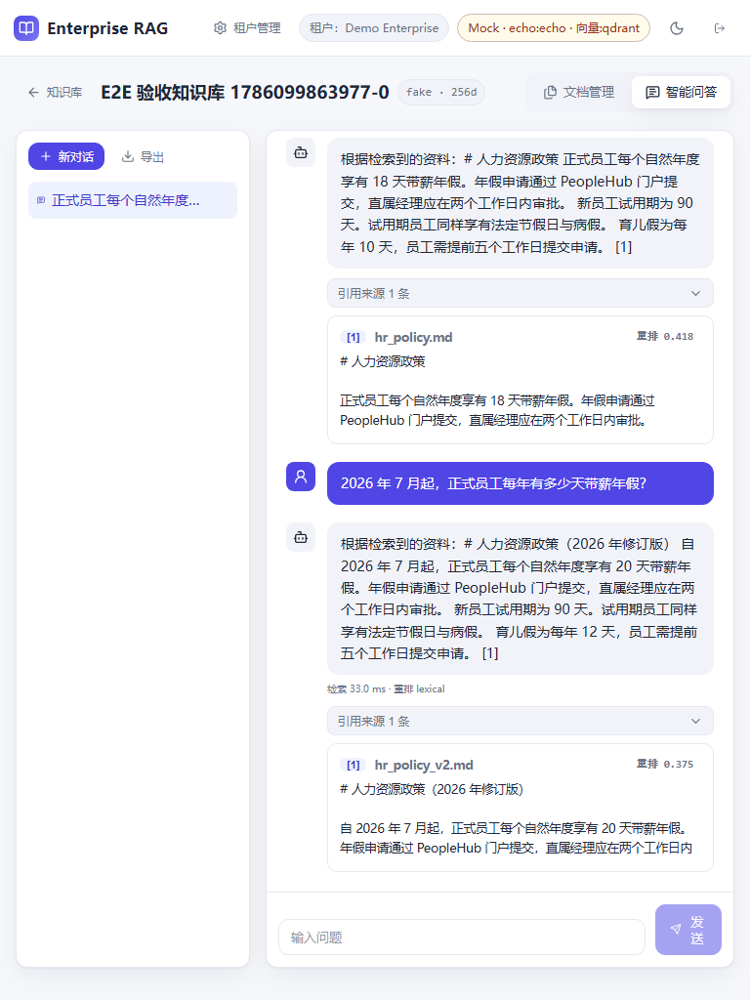
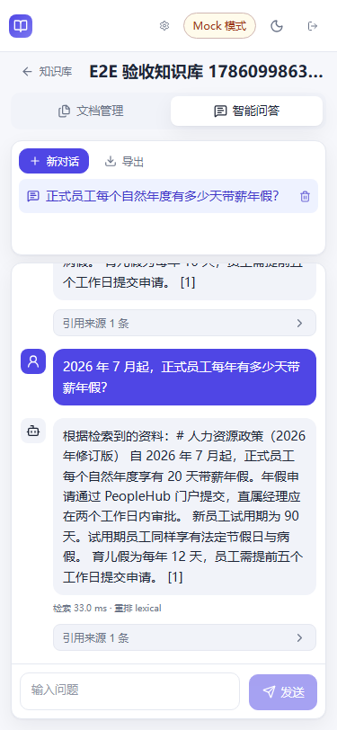

# Enterprise RAG

当前版本：`1.0.0-rc.1`

Enterprise RAG 是一个面向企业知识库试用和工程验收的 RAG 发布候选版。用户可以登录后创建知识库，导入文件或网页，查看入库进度与版本，执行混合检索，并进行带原文定位的流式问答；租户管理员可以管理用户、角色、权限和审计记录。

> 默认配置使用 `fake` Embedding 与 `echo` LLM。它们是确定性的零密钥测试替身，界面和健康接口都会显示 **Mock 模式**，不代表真实模型的理解能力或回答质量。

## 已闭环能力

- 认证与隔离：JWT 登录、租户内 RBAC、所有知识库/文档/版本/会话/审计对象的服务端租户过滤，以及跨租户读写删测试。
- 租户管理：用户创建、停启、改密、角色分配，角色与权限维护，最后一名管理员和系统角色保护。
- 可靠入库：文件头和大小校验、网页 SSRF 防护、SHA-256 幂等、持久任务进度、取消、重试、失败原因与主动对账。
- 文档版本：新版本先写入暂存 Chunk 和向量，数据库激活成功后再清理旧版本；失败时保留旧活动版本。模型或维度变化通过新 collection 完成后切换。
- 检索与问答：向量召回、BM25、RRF、可选重排、分段耗时与降级诊断；无可靠证据时回答“不知道”。
- 真实引用：引用绑定活动 `chunk_id`、文档、版本、页码和原文片段；前端可跳转并高亮原文。PDF 页码链路有自动化测试。
- 运维：PostgreSQL、Qdrant、Redis 与模型 readiness，结构化日志、`X-Request-ID`、Prometheus 指标、Alembic 自动迁移、发布 smoke 和三类数据恢复演练。

支持上传：PDF、DOCX、XLSX、Markdown、TXT、CSV、HTML。扫描 PDF 不含 OCR，无法提取文本时会失败，不会假装入库成功。

## 推荐启动路径

### 环境基线

| 项目 | 支持基线 | 本次发布候选实测 |
| --- | --- | --- |
| OS | Windows 11、现代 Linux 或 macOS 的 Docker 环境 | Windows 11 Pro `10.0.26200` |
| Docker | Engine 24+，Compose 插件 2.20+ | Engine `29.6.1`，Compose `5.3.0` |
| 资源 | 4 vCPU、8 GiB RAM、10 GiB 可用磁盘 | 16 vCPU、约 16.4 GiB Docker 内存 |
| 原生开发 | Python 3.11、Node.js 22 | Python `3.11.15`、Node.js 22 |

首次拉取镜像和构建需要联网。默认服务只占用宿主机 `19020-19024`。

Windows：

```bat
copy .env.example .env
docker compose up -d --build --wait
docker compose ps
```

macOS / Linux：

```bash
cp .env.example .env
docker compose up -d --build --wait
docker compose ps
```

打开：

- Web：<http://127.0.0.1:19020>
- OpenAPI：<http://127.0.0.1:19021/docs>
- 就绪检查：<http://127.0.0.1:19021/api/health/ready>
- Prometheus：<http://127.0.0.1:19021/metrics>

本地演示账号：

```text
admin@example.com
ChangeMe123!
```

该账号和密码只用于本地 Mock 演示。`ENVIRONMENT=production` 时，应用会拒绝演示密钥、演示密码、宽松 CORS 或 Mock 模型配置。

### 3–5 分钟演示

1. 登录后创建知识库。
2. 上传 `sample-docs/员工手册.md`，观察进度到 100% 且状态为“数据一致”。
3. 在问答页提问文档中的明确事实，展开引用并跳转到原文。
4. 回到文档页上传新版本，确认版本历史和新答案只引用活动版本。
5. 进入“租户管理”查看用户、角色权限与审计记录。

### 自动验收

栈就绪后执行以下命令。脚本会真实走登录、建库、v1 入库、混合检索、SSE、引用核对、Markdown 导出、v2 更新、对账和删除；失败会非零退出，测试数据会自动清理。

```bash
docker compose exec -T backend python scripts/release_smoke.py --base-url http://127.0.0.1:8000 --frontend-url http://frontend
```

停止服务但保留数据：

```bash
docker compose down
```

仅在确认要删除本地数据库、向量、Redis 和上传文件时执行：

```bash
docker compose down -v
```

## 端口

| 端口 | 服务 |
| ---: | --- |
| `19020` | Nginx + Vue Web |
| `19021` | FastAPI / OpenAPI / metrics |
| `19022` | Qdrant HTTP |
| `19023` | PostgreSQL |
| `19024` | Redis |
| `19025-19026` | 仅备份恢复演练的隔离临时服务 |

## 配置与真实模型

`.env.example` 是安全的零密钥演示配置。接入真实提供方时，在未提交的 `.env` 中覆盖 `EMBEDDING_*`、`LLM_*` 和实际维度。代码支持 OpenAI-compatible 与 Ollama；真实模型的泛化质量、成本、速率限制和数据合规必须在目标提供方上另行验收。

知识库会保存 Embedding provider、model 和 dimension 快照。修改模型或维度后必须执行知识库重建；系统在新 collection 完整构建成功前不会切换活动 collection。

完整配置说明见 [部署文档](DEPLOYMENT.md) 和 [运行手册](RUNBOOK.md)。

## API 与权限

除健康检查和登录外，业务 API 均要求 `Authorization: Bearer <token>`。主要资源包括：

- `/api/auth/*`：登录与当前主体。
- `/api/admin/*`：租户内用户、角色、权限与审计。
- `/api/knowledge-bases/*`：知识库、重建任务。
- `/api/knowledge-bases/{kb_id}/documents/*`：文件/URL 入库、版本、任务、原文、重嵌入与对账。
- `/api/retrieve`、`/api/chat`：检索预览与 SSE/非流式问答。
- `/api/conversations/*`：消息、Markdown 导出与删除。

详细契约以运行时 `/docs` 和 [API 指南](docs/API.md) 为准；租户与权限边界见 [多租户说明](MULTI_TENANCY.md)。

## 可复现质量证据

- 固定评估集：31 个可审查用例。零密钥 HTTP 实测 `Hit@5=1.0000`、`MRR=1.0000`，引用正确率、无答案、提示注入、租户隔离和多轮门禁均为 `1.0000`。这是固定夹具上的工程回归，不是外部模型质量声明。
- 性能：固定 Docker fixture 下普通读 p95 `136.25ms`、混合检索 p95 `225.16ms`、本地写 p95 `106.37ms`，业务错误率 `0`。环境、命令与边界见 [性能报告](PERFORMANCE_REPORT.md)。
- 浏览器：正式 Chromium E2E 覆盖租户登录、UI 建库、v1/v2 入库、流式问答、真实引用定位、管理三视图和自动清理；Lighthouse 桌面实测 Performance/Accessibility/Best Practices 为 `97/100/100`。
- 发布长链路：`backend/scripts/release_smoke.py`。
- 备份恢复：`backend/scripts/backup_restore_drill.py`，覆盖 PostgreSQL、Qdrant snapshot 与上传原文件，并在隔离恢复栈验证登录、检索、问答和引用。
- CI：后端 pytest；前端 audit/lint/test/typecheck/build；空 Compose 栈自动迁移、readiness、发布长链路、Playwright E2E 与 Lighthouse 阈值。

### 真实浏览器截图

桌面 1440x900：



平板 768x1024：



移动端 375x812：



本地复现命令见 [使用指南](docs/USAGE.md)。

## 已知边界

- 默认 `fake/echo` 只用于确定性工程演示；真实模型 BYOK 质量仍是部署方的外部验收项。
- 不支持扫描 PDF OCR，也不提供 PDF 对话导出；v1 只提供经过测试的 Markdown 导出。
- 入库任务由应用进程恢复和执行，不是独立分布式任务队列。多副本部署前需要明确单写者或外置队列策略。
- 默认 Compose 是单机试用拓扑，不等同于公网生产架构；TLS、WAF、集中日志、告警和托管备份需在目标环境补齐。
- Cross-encoder 重排是可选依赖；默认镜像使用可确定验证的 lexical reranker。

## 文档

- [架构与一致性边界](docs/architecture.md)
- [API 指南](docs/API.md)
- [使用与测试](docs/USAGE.md)
- [部署](DEPLOYMENT.md)
- [运行、故障与恢复](RUNBOOK.md)
- [安全策略](SECURITY.md)
- [多租户与权限](MULTI_TENANCY.md)
- [变更记录](CHANGELOG.md)

## 许可证

[MIT](LICENSE)
