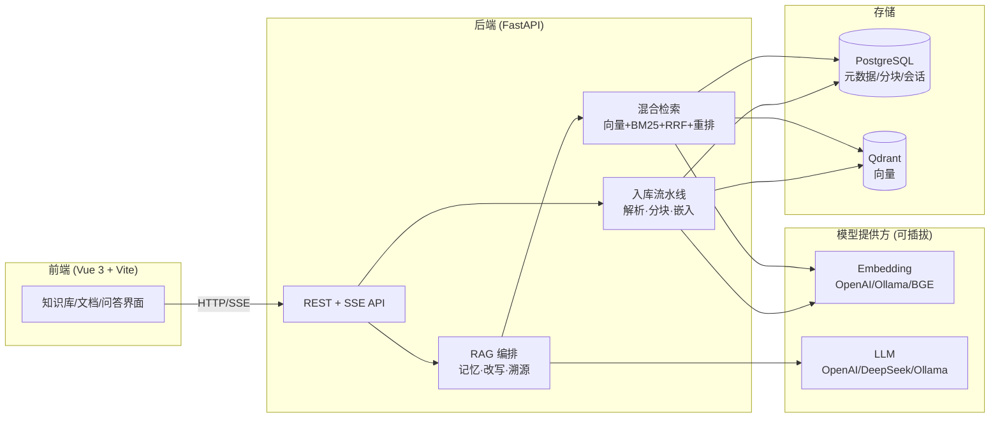
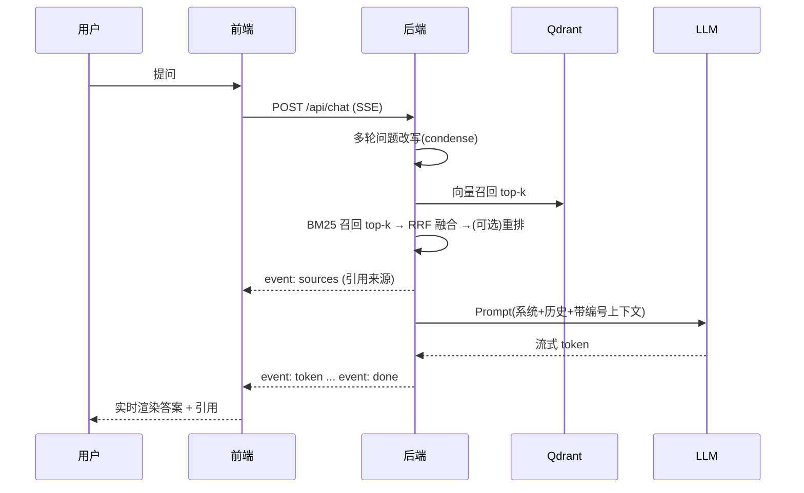
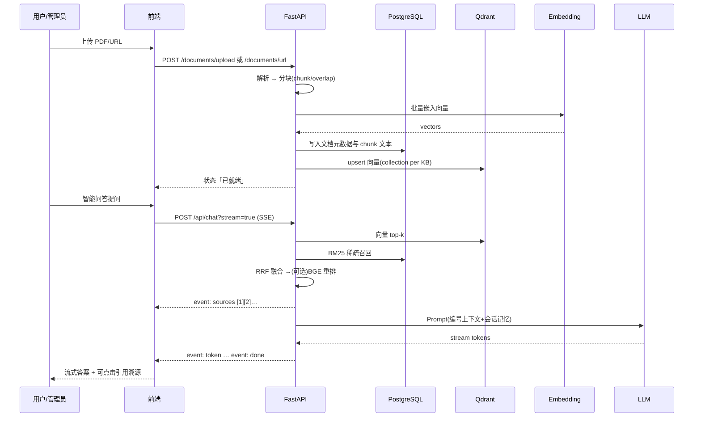

# Enterprise RAG · 企业知识库 RAG 问答系统

> 一套生产级的企业知识库检索增强问答（RAG）系统：多格式文档接入、**向量 + BM25 混合检索 + 重排**、**流式问答与引用溯源**、多知识库隔离、可插拔的 Embedding/LLM 提供方，一条 `docker compose` 命令即可拉起全套服务。

<p>
  <a href="https://github.com/Hou-mingyuan/enterprise-rag/actions/workflows/ci.yml"></a>
  
  
  
  
  
</p>

📰 **CSDN 长文**：[`docs/csdn/enterprise-rag.md`](docs/csdn/enterprise-rag.md)（架构 mermaid + Docker smoke + 面试 3 问 3 答）

---

## ✨ 项目亮点

- **混合检索 + 重排**：向量语义检索（Qdrant）与 BM25 关键词检索（jieba 中文分词）并行召回，经 **RRF 倒数秩融合**，可选接入 **BGE 交叉编码器**精排——语义与术语兼顾，明显优于单路检索。
- **引用溯源**：回答分块编号 `[1][2]`，返回命中的**文档名、页码、原文片段与相关度分数**，答案可核实、可追溯，杜绝“一本正经胡说”。
- **流式问答**：基于 SSE 的逐 token 流式输出，先返回检索来源、再流式生成，前端实时呈现。
- **多格式接入**：PDF / Word / Excel / Markdown / TXT / CSV / HTML / 网页 URL，自动解析 → 分块 → 向量化 → 索引，页码信息贯穿至溯源。
- **多租户权限闭环**：内置租户、用户、角色、权限、JWT Bearer 登录；知识库、文档、会话均由后端按 `tenant_id` 强制隔离。
- **多知识库隔离**：每个知识库独立 Qdrant collection 与 Embedding 空间快照，创建 / 隔离 / 删除 / 重嵌入一应俱全。
- **对话记忆 + 多轮改写**：注入历史轮次并对追问做 condense 改写，提升“它多少钱”这类指代问题的召回。
- **可插拔提供方**：Embedding 与 LLM 支持 **OpenAI 兼容 / DeepSeek / 本地 Ollama / 本地 BGE**，环境变量切换，密钥走 `.env`。
- **零依赖本地体验**：内置 `memory` 向量后端 + SQLite + `fake/echo` 提供方，无需任何外部服务或密钥即可跑通与测试。
- **生产安全基线**：SSRF 防护、审计日志、安全响应头、请求超时、单进程限流、Alembic 正式迁移骨架、pytest 端到端测试、Docker 一键部署、CI、部署/运行/安全/性能文档。

## 💼 面试速览（3 问 3 答）

> 完整版见 [CSDN 长文 §七](docs/csdn/enterprise-rag.md#七面试-3-问-3-答)

**Q1：为什么 RAG 要混合检索，而不是只用向量？**
向量擅长语义相似，但对 rare token、法规编号、SKU 等精确匹配弱；BM25 补稀疏通道。RRF 融合两路排序，避免分数尺度不一致；可选 BGE 重排再压噪声进 Prompt。

**Q2：如何降低幻觉、让业务方敢用？**
(1) 检索阈值 + 重排控制 chunk 质量；(2) Prompt 约束「仅依据参考文档」+ 编号引用 `[n]`；(3) SSE 先返回 `sources`，UI 展示原文片段与页码。关键场景仍建议人工复核 + 审计日志。

**Q3：多租户隔离在数据层怎么落地？**
元数据表带 `tenant_id`，JWT 解析当前租户，所有查询带 tenant 过滤；向量侧按知识库独立 Qdrant collection。越权测试见 [MULTI_TENANCY.md](MULTI_TENANCY.md) 与 pytest 用例。

## 🏗️ 系统架构



检索链路（一次问答）：



文档入库 → 检索 → 问答全链路（与 [CSDN 长文](docs/csdn/enterprise-rag.md) 对齐）：



## 🛡️ 限流策略与 Redis 升级路径

应用层默认启用 **`InMemoryRateLimitMiddleware`**（单进程固定窗口），按客户端 IP 统计每分钟请求数，超限返回 **HTTP 429** + `Retry-After: 60`。配置项：

| 变量 | 说明 | 默认 |
| --- | --- | --- |
| `RATE_LIMIT_REQUESTS_PER_MINUTE` | 单 IP 每分钟请求上限 | `600` |

**当前实现（单机 / 演示）**

- 适用：Docker Desktop 单副本、`uvicorn` 本地开发、作品集 smoke。
- 机制：进程内 `defaultdict` 按 `(client_ip, minute_window)` 计数；窗口滑动时自动清理旧 bucket（见 `backend/app/security_middleware.py`）。
- 局限：**多 Uvicorn worker 或多 Pod 副本时各实例独立计数**，无法全局共享配额。

**生产推荐：Redis 分布式限流（P2 Roadmap）**

多副本部署时，应将限流上移到以下任一层（优先级从高到低）：

1. **API 网关**（Nginx `limit_req`、Kong、APISIX）— 在入口统一限流，不侵入应用代码。
2. **Redis 滑动窗口 / 令牌桶** — 各副本共享计数器，键示例 `ratelimit:{tenant_id}:{client_ip}`，Lua 脚本保证原子性。
3. **应用层 Redis 中间件** — 替换 `InMemoryRateLimitMiddleware`，读取 `REDIS_URL`，失败时降级为本地限流或 fail-open（可配置）。

规划环境变量（尚未在代码中强制要求，供部署参考）：

```bash
# 分布式限流（Roadmap）
RATE_LIMIT_BACKEND=redis          # memory | redis
REDIS_URL=redis://redis:6379/0
RATE_LIMIT_REQUESTS_PER_MINUTE=600
RATE_LIMIT_BURST=50               # 可选：令牌桶突发
```

**运维提示**：429 排查见 [RUNBOOK.md §429](RUNBOOK.md)；安全审计记录见 [SECURITY_AUDIT.md](SECURITY_AUDIT.md)（单进程限流 → Redis/网关为已知剩余风险）。k6 压测 100 VU 场景下，建议在网关层设置 per-tenant 配额，避免单租户打满共享 LLM 配额。

## 🧰 技术栈

| 层 | 选型 |
| --- | --- |
| 后端 | Python 3.11、FastAPI、SQLModel、Pydantic v2、Uvicorn、sse-starlette |
| 检索 | Qdrant（向量）、rank-bm25 + jieba（稀疏）、RRF 融合、BGE-reranker（可选） |
| 分块 | LangChain `RecursiveCharacterTextSplitter`（中文标点友好） |
| 解析 | pypdf、python-docx、openpyxl、BeautifulSoup(lxml) |
| 模型 | OpenAI SDK（OpenAI 兼容 / DeepSeek）、Ollama、sentence-transformers（BGE 可选） |
| 存储 | PostgreSQL（元数据/分块/会话）、SQLite（本地默认） |
| 前端 | Vue 3、Vite、TypeScript、Pinia、Vue Router、Axios、原生 Fetch SSE |
| 部署 | Docker、docker-compose、Nginx |

## 📁 目录结构

```
enterprise-rag/
├─ backend/
│  ├─ app/
│  │  ├─ core/         # 抽象层：embeddings / llm / vector_store / reranker
│  │  ├─ services/     # 解析 / 分块 / BM25 / 入库 / 检索 / RAG 编排
│  │  ├─ api/          # 路由：认证 / 后台用户 / 知识库 / 文档 / 问答 / 会话
│  │  ├─ config.py     # 配置（pydantic-settings）
│  │  ├─ models.py     # SQLModel 数据模型
│  │  └─ main.py       # FastAPI 入口
│  ├─ scripts/evaluate.py  # 检索/答案质量评估
│  ├─ alembic/         # 生产数据库迁移脚本
│  ├─ tests/           # pytest 端到端测试（离线可跑）
│  ├─ requirements*.txt
│  └─ Dockerfile
├─ frontend/           # Vue3 + Vite 前端
├─ sample-docs/        # 示例文档（员工手册/产品FAQ/公司简介）
├─ docs/               # 架构与使用指南
├─ DEPLOYMENT.md       # 生产部署说明
├─ RUNBOOK.md          # 运维运行手册
├─ MULTI_TENANCY.md    # 租户与权限模型
├─ SECURITY.md         # 漏洞报告与安全策略
├─ SECURITY_AUDIT.md   # 安全审计记录
├─ PERFORMANCE_REPORT.md
├─ performance/        # k6 压测脚本
├─ docker-compose.yml
├─ .env.example
└─ README.md
```

## 🚀 快速开始

### 方式一：Docker 一键启动（推荐）

```bash
cd enterprise-rag
cp .env.example .env          # 填入模型密钥；或改用本地 Ollama（见配置）
docker compose up -d --build
```

启动后：

- 前端界面： http://localhost:8080
- 后端接口文档： http://localhost:8000/docs
- 健康检查： http://localhost:8000/api/health

如本机端口已被其他项目占用，可在 `.env` 中覆盖宿主机端口：

```bash
FRONTEND_HOST_PORT=18087
BACKEND_HOST_PORT=18086
QDRANT_HOST_PORT=16333
docker compose up -d --build
```

无真实模型 Key 时，可使用离线 smoke 配置验证 Docker、上传、检索和流式问答链路：

```bash
EMBEDDING_PROVIDER=fake
EMBEDDING_MODEL=fake
EMBEDDING_DIM=64
LLM_PROVIDER=echo
LLM_MODEL=echo
docker compose up -d --build
```

### 演示账号（本地 Docker / 开发）

| 字段 | 默认值（`.env.example`） |
| --- | --- |
| 邮箱 | `admin@example.com` |
| 密码 | `ChangeMe123!` |

生产环境必须覆盖 `BOOTSTRAP_ADMIN_EMAIL` / `BOOTSTRAP_ADMIN_PASSWORD`，勿使用默认密码。

公网 HTTPS 部署与验收证据模板见 [DEPLOYMENT.md §8](DEPLOYMENT.md#8-公网-https-部署证据验收模板)；运维 runbook 见 [RUNBOOK.md](RUNBOOK.md)。

首次使用：进入前端 → 用上表账号登录 → 新建知识库 → 上传 `sample-docs/` 中的示例文档 → 待状态变为「已就绪」→ 在「智能问答」中提问（如“员工每年有多少天年假？”），即可得到带来源引用的流式回答。

### 方式二：本地开发（零外部依赖）

后端（默认 SQLite + 内存向量库，`fake/echo` 提供方即可跑通链路）：

```bash
cd backend
python -m venv .venv && . .venv/Scripts/activate   # Windows
# source .venv/bin/activate                          # macOS/Linux
pip install -r requirements-dev.txt
uvicorn app.main:app --reload
```

如需真实问答，在 `backend/.env` 或环境变量中配置 `LLM_*` / `EMBEDDING_*`（见下）。

前端（Vite 8 需要 Node.js 20.19+ 或 22.12+）：

```bash
cd frontend
npm install
npm run dev        # http://localhost:5173 ，已代理 /api 到 http://localhost:8000
```

## ⚙️ 配置说明

所有配置均可通过环境变量或 `.env` 覆盖，完整项见 [`.env.example`](.env.example)。常用组合：

| 场景 | 关键配置 |
| --- | --- |
| OpenAI（最省事） | `EMBEDDING_PROVIDER=openai` `LLM_PROVIDER=openai` + 一把 `*_API_KEY` |
| DeepSeek 做 LLM | `LLM_BASE_URL=https://api.deepseek.com/v1` `LLM_MODEL=deepseek-chat`；Embedding 仍用 OpenAI 或 Ollama |
| 全本地 Ollama | `EMBEDDING_PROVIDER=ollama` `EMBEDDING_MODEL=bge-m3` `LLM_PROVIDER=ollama` `LLM_MODEL=qwen2.5:7b` |

| 变量 | 说明 | 默认 |
| --- | --- | --- |
| `VECTOR_BACKEND` | `qdrant` / `memory` | `memory` |
| `AUTH_SECRET_KEY` | JWT 签名密钥，生产环境必须覆盖为高熵随机值 | 本地开发默认值 |
| `BOOTSTRAP_ADMIN_EMAIL` / `BOOTSTRAP_ADMIN_PASSWORD` | 默认租户管理员引导账号 | `admin@example.com` / `ChangeMe123!` |
| `EMBEDDING_DIM` | 向量维度，需与模型匹配（text-embedding-3-small=1536，bge-m3=1024） | `1536` |
| `CHUNK_SIZE` / `CHUNK_OVERLAP` | 分块大小 / 重叠 | `800` / `120` |
| `VECTOR_TOP_K` / `BM25_TOP_K` | 两路召回条数 | `20` / `20` |
| `HYBRID_TOP_K` | 融合/重排后进入上下文条数 | `8` |
| `RERANK_ENABLED` | 是否启用交叉编码器重排（需 `requirements-optional.txt`） | `false` |
| `HISTORY_TURNS` | 注入对话记忆的最近轮数 | `6` |
| `REQUEST_TIMEOUT_SECONDS` | 单请求服务端超时 | `60` |
| `RATE_LIMIT_REQUESTS_PER_MINUTE` | 单客户端每分钟请求数上限 | `600` |
| `URL_FETCH_TIMEOUT_SECONDS` / `URL_FETCH_MAX_REDIRECTS` / `URL_FETCH_MAX_MB` | 外部 URL 抓取超时、重定向与下载大小限制 | `10` / `3` / `5` |

> ⚠️ 更换 Embedding 模型或维度后，请对已有文档执行「重嵌入」，否则向量空间不一致会导致检索异常。

## 🔌 API 概览

| 方法 | 路径 | 说明 |
| --- | --- | --- |
| POST | `/api/auth/login` | 登录并获取 Bearer token |
| GET | `/api/auth/me` | 当前登录用户与租户 |
| GET/POST | `/api/admin/users` | 租户内用户列表 / 创建用户 |
| GET | `/api/admin/audit-logs` | 租户内关键操作审计日志 |
| POST | `/api/knowledge-bases` | 创建知识库 |
| GET | `/api/knowledge-bases` | 知识库列表 |
| DELETE | `/api/knowledge-bases/{id}` | 删除（级联清理向量/文档/会话） |
| POST | `/api/knowledge-bases/{id}/documents/upload` | 上传文件 |
| POST | `/api/knowledge-bases/{id}/documents/url` | 抓取网页入库 |
| POST | `/api/knowledge-bases/{id}/documents/{docId}/reembed` | 重嵌入 |
| POST | `/api/retrieve` | 检索预览（调参/评估用，不走 LLM） |
| POST | `/api/chat` | RAG 问答（`stream=true` 走 SSE） |
| GET | `/api/conversations/{id}/messages` | 会话消息 |

除 `/api/health` 与 `/api/auth/login` 外，业务 API 均需要 `Authorization: Bearer <token>`。

完整交互式文档见 `/docs`（Swagger UI）。

## 📊 评估

```bash
# 先启动后端，并在某知识库导入 sample-docs
python backend/scripts/evaluate.py --api http://localhost:8000 \
    --kb-id <KB_ID> --dataset backend/scripts/sample_eval.jsonl --top-k 5
```

输出 `Hit@k` 与 `MRR`；加 `--ragas` 可在安装 `requirements-optional.txt` 后评估答案质量（faithfulness / answer_relevancy / context_precision）。

## ✅ 测试

```bash
cd backend
pip install -r requirements-dev.txt
python -m pytest   # 离线：fake embedding + echo LLM + memory 向量库；54 项 · 覆盖率 ≥75%
```

覆盖分块、RRF 融合、中文分词、RAG 编排（上下文截断/问题改写/向量降级）、认证、租户隔离与越权防护、SSRF 拒绝、安全响应头，以及「登录→建库→上传→入库→检索→问答→会话」端到端链路。

## 🖼️ 界面截图

> 占位：请将实际运行截图放至 `docs/screenshots/` 并替换下方引用。

| 知识库管理 | 文档管理 | 智能问答（引用溯源） |
| --- | --- | --- |
|  |  |  |

## 🗺️ Roadmap

- [x] 用户体系、知识库级权限（RBAC）与租户隔离后端基础
- [x] SSRF 防护、审计日志、安全响应头、请求超时、单进程限流和 Alembic 迁移骨架
- [ ] Redis 分布式限流中间件（替换 `InMemoryRateLimitMiddleware`，多副本共享配额）
- [ ] 角色权限管理 UI
- [ ] 文档版本管理与增量更新
- [ ] 更多重排策略（ColBERT、LLM-as-reranker）与查询扩展
- [ ] Agentic RAG：多跳检索与工具调用
- [ ] 导出对话为 Markdown / PDF
- [ ] 检索结果高亮与原文定位跳转
- [ ] 观测性：请求追踪、检索质量看板

## 📄 许可证

本项目基于 [MIT License](LICENSE) 开源。示例文档内容均为虚构，仅用于演示。
