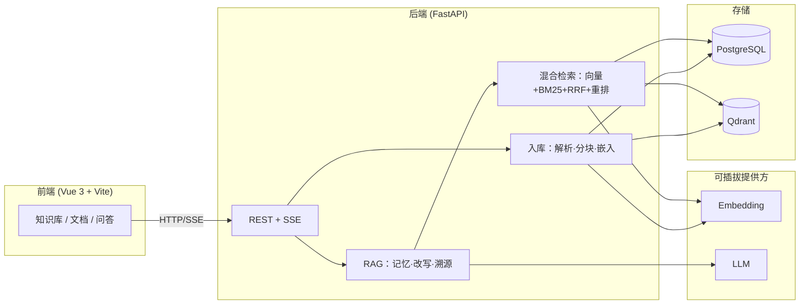

# Enterprise RAG · 面试速览

> 架构图 + 3 问 3 答。完整技术细节见 [CSDN 长文](./csdn/enterprise-rag.md) 与 [README](../README.md)。

## 系统架构



## 3 问 3 答

**Q1：为什么 RAG 要混合检索，而不是只用向量？**  
向量擅长语义相似，但对 rare token、法规编号、SKU 等精确匹配弱；BM25 补稀疏通道。RRF 融合两路排序，避免分数尺度不一致；可选 BGE 重排再压噪声进 Prompt。

**Q2：如何降低幻觉、让业务方敢用？**  
(1) 检索阈值 + 重排控制 chunk 质量；(2) Prompt 约束「仅依据参考文档」+ 编号引用 `[n]`；(3) SSE 先返回 `sources`，UI 展示原文片段与页码。关键场景仍建议人工复核 + 审计日志。

**Q3：多租户隔离在数据层怎么落地？**  
元数据表带 `tenant_id`，JWT 解析当前租户，所有查询带 tenant 过滤；向量侧按知识库独立 Qdrant collection。越权测试见 [MULTI_TENANCY.md](../MULTI_TENANCY.md) 与 pytest 用例。

## 验收

```powershell
cd frontend
npm run build
# Playwright 截图（需栈运行）：node scripts/ui-screenshots.mjs
```

## 截图归档（面试速览）

| 截图 | 说明 |
| --- | --- |
| [06-chat-citations-after.png](./ui-refresh/06-chat-citations-after.png) | 问答引用溯源 UI（Round-5 ui-refresh） |
| [02-dashboard-light-after.png](./ui-refresh/02-dashboard-light-after.png) | 工作台统计卡 + 知识库网格 |

完整产出见 [ui-refresh/README.md](./ui-refresh/README.md)。
