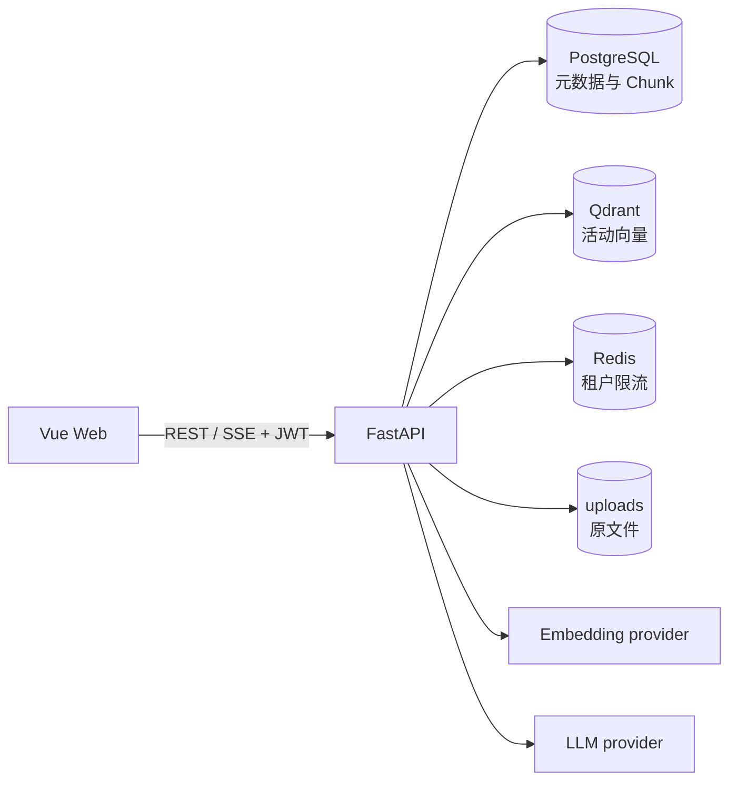
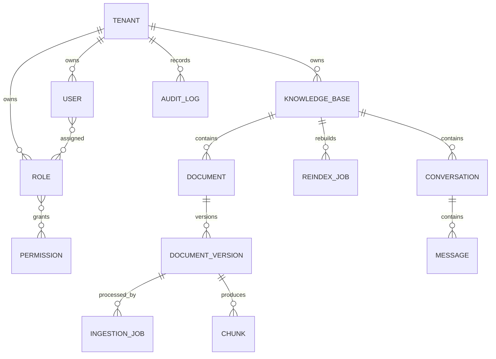
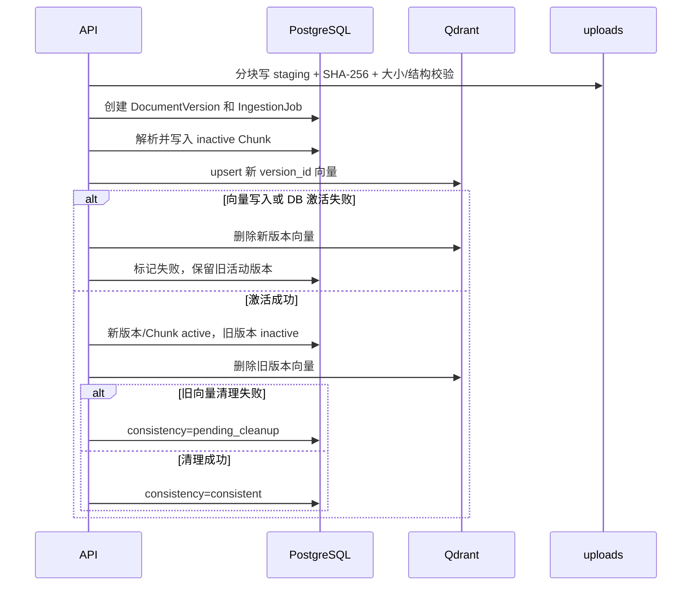
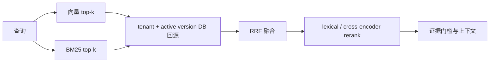

# Enterprise RAG 架构与一致性设计

适用版本：`1.0.0-rc.1`。

## 组件



代码依赖方向：

```text
api -> services -> core adapters
 |        |             |
schemas  domain flow   embedding / llm / vector / reranker
       -> SQLModel + storage
```

- `api/` 负责鉴权依赖、输入/输出契约与 HTTP/SSE 编排。
- `services/` 负责入库、重建、检索、RAG 与 BM25 业务状态机。
- `core/` 提供 Embedding、LLM、vector store 和 reranker 契约。
- PostgreSQL 是租户关系、版本状态、Chunk 正文、会话和审计的权威来源。
- Qdrant 是可由活动 Chunk 和 Embedding 配置重建的检索派生数据。
- uploads 是重嵌入和原始文件恢复所需的持久数据，不能只备份数据库。

## 领域模型



所有业务对象包含租户归属。子对象查询同时约束当前租户和父对象关系；Qdrant 回源也必须经过数据库的租户、知识库、文档、版本与 `is_active` 条件。

## 可靠入库与版本切换

一次文件版本更新不是跨 PostgreSQL/Qdrant 的分布式事务，因此采用“暂存、激活、补偿、对账”：



关键不变量：

1. 同一文档最多一个活动版本。
2. 检索只返回活动版本的活动 Chunk。
3. 活动版本在目标 collection 中的向量数应等于活动 Chunk 数。
4. 失败的新版本不能使旧版本不可用。
5. 相同 SHA-256 内容不创建重复活动向量。

`reconcile` 从 PostgreSQL 活动 Chunk 重算并 upsert 当前向量，删除该文档的非活动版本向量，再核对精确数量。删除文档/知识库时先保存恢复所需的向量 payload；若数据库删除失败，会恢复向量，避免只删一侧。

## Embedding 空间变更

知识库保存 provider、model、dimension 和活动 `vector_collection`。变更模型或维度时不会原地重用 collection：

1. 创建新的 revision collection 并校验维度。
2. 对所有活动 Chunk 重新计算并写入向量。
3. 核对精确数量后在数据库切换知识库 collection/config。
4. 清理旧 collection；清理失败保留可重试的重建任务。

切换前任何失败都不会改变旧活动 collection。这避免不同向量空间混写和半成品 collection 对外可见。

## 混合检索



- 向量路与 BM25 路分别记录状态、候选数和耗时。
- RRF 只依赖名次，不假设两路分数同量纲。
- 默认 lexical reranker 是确定性实现；cross-encoder 为可选依赖。重排不可用时 diagnostics 明确记录降级，不伪装成功。
- 向量库失败时可以使用 BM25 结果；两路均无有效证据时不调用 LLM 生成事实答案。
- Jieba 词典在 readiness 前预热，避免首个检索承担数秒冷启动。

`/api/retrieve` 返回每个结果的 vector/BM25/RRF/rerank 信号，以及分阶段 diagnostics，便于评估和排障。

## 回答与引用

RAG 生成前完成：会话归属检查、最近轮次问题改写、混合检索、提示注入 Chunk 隔离和最低证据门槛。无足够证据时返回固定“不知道”，sources 为空。

模型上下文中的来源按 `[1]...[n]` 编号。最终答案必须引用有效编号；服务端解析编号、拒绝越界或缺失引用，并只返回实际被引用的结构化来源。来源字段绑定：

```text
tenant_id -> kb_id -> document_id -> version_id -> chunk_id -> page -> content
```

前端引用定位读取数据库 Chunk，而不是相信模型重新生成的文档名或页码。PDF 解析按页生成 Section，页码从 parser 贯穿到 Chunk、检索结果和来源。

流式协议使用 `meta`、`sources`、`token`、`replace`、`done`、`error` 事件；每轮由客户端 `request_id` 幂等。连接中断时客户端只用相同 ID 自动重连一次，服务端不会为同一回合持久化重复消息。

## 任务恢复

入库和知识库重建任务持久化阶段、进度、尝试次数、取消标记和错误。进程重启时会恢复未完成任务。任务执行目前位于应用进程，没有外部分布式租约，因此单机或单写 worker 是 v1 的明确边界。

## 可观测性

- 每个 HTTP 响应返回 `X-Request-ID`。
- 日志是字段白名单的单行 JSON，不记录正文、Prompt 或凭据。
- `/api/health/live` 只检查进程；`/api/health/ready` 检查实际依赖。
- `/metrics` 暴露 HTTP 状态/耗时/并发和检索阶段状态/耗时。
- 检索响应 diagnostics 面向单次请求；Prometheus 面向聚合趋势。

## 部署和恢复边界

Compose 使用 PostgreSQL、Qdrant、Redis、backend、frontend 五服务，backend 启动前自动 `alembic upgrade head`。完整恢复点必须同时包含 PostgreSQL dump、相同 Qdrant minor 版本的 collection snapshots 和 uploads；恢复后还需从 API 验证原文、检索事实和引用。

详见 [部署文档](../DEPLOYMENT.md) 和 [运行手册](../RUNBOOK.md)。
