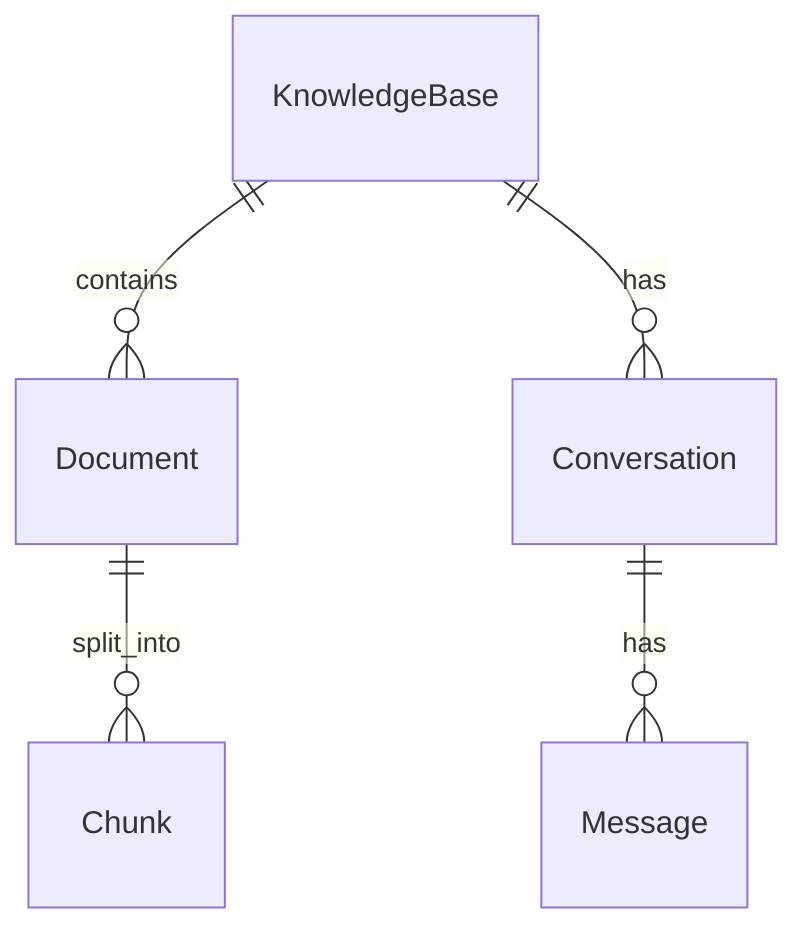

# 架构设计说明

本文补充说明 Enterprise RAG 的分层设计与关键取舍，便于二次开发。

## 分层

```
api/         对外 REST + SSE；仅做参数校验、依赖注入与响应编排
services/    业务编排：解析 / 分块 / BM25 / 入库 / 检索 / RAG
core/        与外部系统对接的抽象：embeddings / llm / vector_store / reranker
models.py    SQLModel 持久化模型（KB / Document / Chunk / Conversation / Message）
config.py    统一配置（pydantic-settings）
```

依赖方向自上而下：`api → services → core`，`core` 不反向依赖业务，便于替换实现与单测。

## 关键设计取舍

### 1. 正文落库、向量库只存向量
Chunk 正文存 PostgreSQL，Qdrant 仅存向量 + `{chunk_id, document_id}` 轻量 payload。好处：
- BM25 稀疏索引可随时从库重建，无需二次存储；
- 引用溯源直接读库还原片段，避免向量库承担存储职责；
- 关系库是唯一“真相源”，删除/重嵌入一致性更好。

### 2. 混合检索 = 向量 + BM25 + RRF
向量擅长语义泛化，BM25 擅长专有名词/型号/编号的精确匹配。两路 top-k 各自召回后用
**RRF（Reciprocal Rank Fusion）** 融合——无需可比分数、对量纲不敏感、实现稳健，是工业界常用默认策略。
可选再接 **交叉编码器（BGE-reranker）** 对候选精排（惰性加载，未装/未启用自动降级）。

### 3. 每库一 collection + Embedding 空间快照
知识库创建时快照 `embedding_provider/model/dim`，并对应独立 Qdrant collection：
- 物理隔离，删库即删 collection；
- 避免不同模型/维度的向量混入同一空间导致检索错乱；
- 换模型必须重嵌入（前端提供入口）。

### 4. 幂等入库
`process_document` 处理前先清理该文档旧 chunk 与旧向量，任何阶段失败都可安全重试；
状态机 `pending → processing → done/failed`，错误信息落库供前端展示。

### 5. 三态可插拔，零依赖可跑
`memory` 向量后端 + SQLite + `fake` embedding + `echo` LLM，使得无任何外部服务、
无密钥即可完成「上传→检索→问答」全链路与自动化测试；生产切 `qdrant + postgres + 真实模型`。

## 数据模型（简）



## 可扩展点

- `core/embeddings.py`、`core/llm.py`：新增提供方只需实现基类；
- `core/vector_store.py`：可接入 Milvus / PGVector 等；
- `core/reranker.py`：可替换为 ColBERT 或 LLM-as-reranker；
- `services/retrieval.py`：可加入查询扩展、多跳检索。
