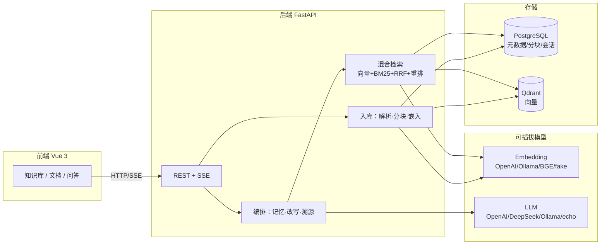
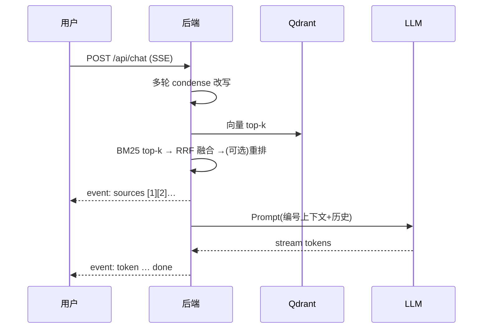

# 从 Demo 到可上线：Enterprise RAG 企业知识库问答系统实战

> 适用读者：做过 RAG Demo、正在考虑「能不能上生产」的后端 / 全栈工程师。  
> 开源仓库：[enterprise-rag](https://github.com/Hou-mingyuan/enterprise-rag)（FastAPI + Vue3 + Qdrant）

---

## 一、为什么「能跑」不等于「能上线」

很多 RAG 教程停在：`LangChain + 向量库 + OpenAI`，本地问一句「公司年假几天」就算完成。真正进企业时，面试官和架构师会问三类问题：

1. **检索准不准**：只靠向量，专有名词、型号、政策编号容易漏召或误召。
2. **答案信不信**：没有引用溯源，业务方不敢用；幻觉一出现就是合规风险。
3. **数据安不安全**：多部门、多租户、JWT、审计、SSRF、限流——Demo 里通常全缺。

**Enterprise RAG** 的定位，就是把上述缺口在一次 `docker compose` 可验收的栈里补齐：混合检索、引用溯源、SSE 流式、多租户隔离、离线 smoke、CI 与部署文档。

---

## 二、系统架构（一图看懂）



一次问答的时序更关键——**先给 sources，再流式 token**：



---

## 三、混合检索：比「只 Embedding」多做了什么

单路向量检索对「语义相近但答案错误」的 chunk 很友好，对「政策第 3.2 条」「SKU-8841」这类**精确词**却可能排后。

Enterprise RAG 的做法：

| 阶段 | 作用 |
| --- | --- |
| 向量召回 | Qdrant 语义 top-20 |
| BM25 召回 | jieba 分词 + 稀疏 top-20 |
| RRF 融合 | 倒数秩融合，不依赖两路分数尺度 |
| BGE 重排（可选） | 交叉编码器精排 top-8 进上下文 |

核心配置（`.env`）：

```bash
VECTOR_TOP_K=20
BM25_TOP_K=20
HYBRID_TOP_K=8
RERANK_ENABLED=false   # 需要 requirements-optional.txt
CHUNK_SIZE=800
CHUNK_OVERLAP=120
```

**引用溯源**在 Prompt 里强制编号 `[1][2]`，SSE 的 `sources` 事件带文档名、页码、片段与分数——前端可点击核对，这是「企业敢用」的底线。

---

## 四、Docker 一键启动 + 零密钥 Smoke

### 4.1 标准启动

```bash
git clone https://github.com/Hou-mingyuan/enterprise-rag.git
cd enterprise-rag
cp .env.example .env
docker compose up -d --build
```

访问：

- 前端：http://localhost:8080  
- API 文档：http://localhost:8000/docs  
- 健康检查：http://localhost:8000/api/health  

演示账号（**生产务必修改**）：

| 邮箱 | 密码 |
| --- | --- |
| `admin@example.com` | `ChangeMe123!` |

流程：登录 → 新建知识库 → 上传 `sample-docs/员工手册.md` → 问「员工每年有多少天年假？」→ 看引用 + 流式答案。

### 4.2 无 API Key 的离线 Smoke（CI / 作品集）

```bash
EMBEDDING_PROVIDER=fake
EMBEDDING_MODEL=fake
EMBEDDING_DIM=64
LLM_PROVIDER=echo
LLM_MODEL=echo
docker compose up -d --build
```

验证整条鉴权 + 入库 + 检索 + 问答链路：

```bash
curl -sf http://localhost:8000/api/health

python backend/scripts/smoke_auth_flow.py \
  --base-url http://127.0.0.1:8000
```

脚本步骤：登录 → 建库 → 上传样例文档 → 等待分块完成 → `/api/retrieve` → SSE `/api/chat`。输出摘要**不含 token 正文**，适合写进 CI 日志。

Hub Profile（Project Hub 端口 **18000/18001**）：

```powershell
cd ai-portfolio/docker
docker compose -f docker-compose.profiles.yml --profile enterprise-rag up -d --build
python ../../enterprise-rag/backend/scripts/smoke_auth_flow.py --base-url http://127.0.0.1:18000
```

---

## 五、多租户与安全基线（面试高频）

- **JWT Bearer** + 租户 `tenant_id` 贯穿知识库、文档、会话；详见 `MULTI_TENANCY.md`。
- **SSRF 防护**：URL 入库白名单 / DNS 校验（`security_network.py`）。
- **审计日志**：管理操作与敏感 API 留痕。
- **Alembic 迁移**：生产库结构可版本化升级。
- **pytest 离线套件**：`fake` embedding + `echo` LLM + `memory` 向量库，PR 上不烧 Key。

生产 checklist：`SECURITY.md`、`DEPLOYMENT.md` §8 公网 HTTPS 验收模板、`RUNBOOK.md` 备份演练。

---

## 六、代码一瞥：SSE 问答入口

FastAPI 路由（简化）：

```python
@router.post("/chat")
async def chat_stream(body: ChatRequest, user: User = Depends(get_current_user)):
    async def event_generator():
        async for event in rag_service.stream_chat(
            kb_id=body.kb_id,
            question=body.question,
            session_id=body.session_id,
            user=user,
        ):
            yield {"event": event.type, "data": event.payload}
    return EventSourceResponse(event_generator())
```

编排层先做 **condense 改写**（解决「它多少钱」指代），再 **hybrid retrieve**，先发 `sources`，再调 LLM 流式输出——前端用原生 `fetch` + SSE 解析即可。

---

## 七、面试 3 问 3 答

**Q1：为什么 RAG 要混合检索，而不是只用向量？**  
A：向量擅长语义相似，但对 rare token、法规编号、SKU 等**精确匹配**弱；BM25 补稀疏通道。RRF 把两路排序融合，避免「向量分 0.82 vs BM25 分 12.3」无法直接相加的问题。可选 BGE 重排再压噪声进 Prompt。

**Q2：如何降低幻觉、让业务方敢用？**  
A：三层：(1) 检索阈值 + 重排，控制进 Prompt 的 chunk 质量；(2) Prompt 约束「仅依据参考文档」+ 编号引用 `[n]`；(3) SSE 先返回 `sources`，UI 展示原文片段与页码，用户可点查。仍建议关键场景人工复核 + 审计日志。

**Q3：多租户隔离在数据层怎么落地？**  
A：元数据表（知识库、文档、会话）带 `tenant_id`，API 层 JWT 解析当前租户，所有查询带 tenant 过滤；向量侧按知识库独立 Qdrant collection，删除 KB 时同步删 collection。越权测试见 `MULTI_TENANCY.md` 与 pytest 用例。

---

## 八、小结与延伸

Enterprise RAG 把「检索质量、溯源、租户、部署证据」当作一等公民，而不是 Demo 后的补丁。建议动手路径：

1. 用 **fake/echo** 跑通 smoke；  
2. 换 **DeepSeek + SiliconFlow Embedding** 看真实效果；  
3. 读 `PERFORMANCE_REPORT.md` 跑 k6；  
4. 按 `DEPLOYMENT.md` §8 采集 HTTPS 验收证据。

仓库 MIT 开源，欢迎 Star / Issue / PR。  
相关文档：[USAGE.md](../USAGE.md) · [RUNBOOK.md](../RUNBOOK.md) · [SECURITY_AUDIT.md](../SECURITY_AUDIT.md)

---

*字数约 2100 字（含代码与表格）；发布 CSDN 时可把 mermaid 导出为图片，代码块保持原样。*
